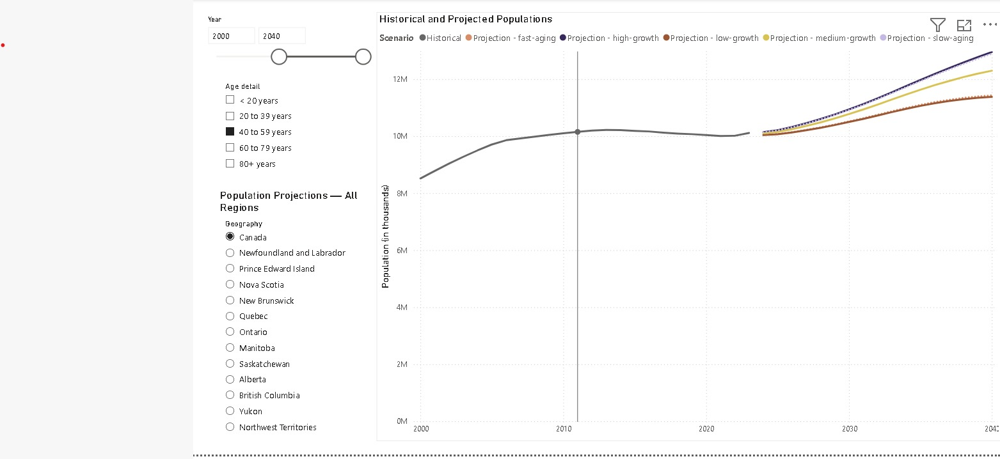
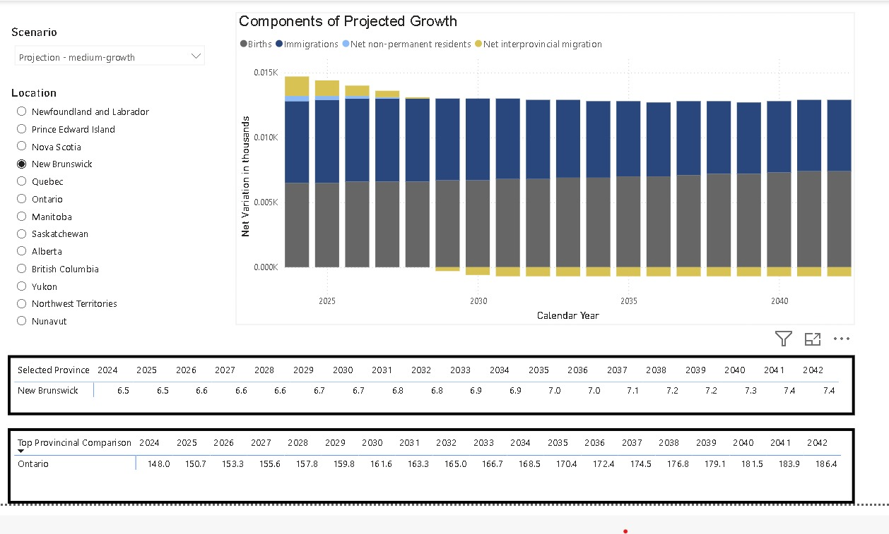
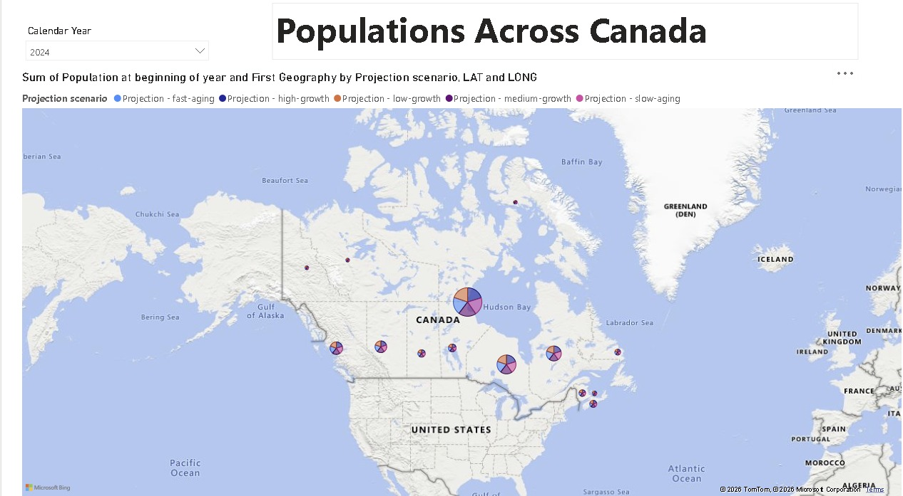

# 🇨🇦 Canadian Population Dashboard — Power BI

An interactive Power BI dashboard exploring **historical and projected Canadian population trends** from national to provincial level. The report covers demographic components including births, deaths, immigration, emigration, and interprovincial migration across multiple projection scenarios (fast-aging, slow-aging, high-growth, low-growth, medium-growth).

---

## 📸 Dashboard Preview

### Page 1 — Historical & Projected Populations

*Line chart showing historical population data from 2000 and projections to 2042, filterable by year range, age group, and geography. Each scenario is colour-coded for easy comparison.*

---

### Page 2 — Components of Projected Growth

*Stacked column chart breaking down the components of population growth (births, immigrations, net non-permanent residents, net interprovincial migration) by calendar year. Includes pivot tables showing selected province data and top provincial comparison.*

---

### Page 3 — Populations Across Canada (Map)

*Bubble map showing population distribution across Canadian provinces and territories. Bubbles are broken down by projection scenario, sized by population at the beginning of the year.*

---

## 📊 Report Pages

| Page | Description | Visuals |
|---|---|---|
| Population Estimates | Historical + projected trends by year, age, and geography | Line chart, Year range slicer, Age detail slicer, Geography slicer |
| Components of Projected Growth | Demographic components of growth by location and scenario | Stacked column chart, 2× Pivot tables, Scenario slicer, Location slicer |
| Populations Across Canada | Geographic bubble map by province and scenario | Bubble map, Calendar year slicer |
| Tooltip *(hover detail)* | Custom tooltip surfacing demographic details on hover | Cards, Multi-row cards |

---

## 📐 DAX Measures

Custom measures built for this report:

| Measure | Description |
|---|---|
| `YoY Population Change` | Absolute population change from the previous year |
| `YoY Growth Rate %` | Year-over-year percentage growth rate |
| `Cumulative Growth Since 2024` | % change relative to 2024 baseline |
| `Net Migration` | Immigrations − Emigrations + Net non-permanent residents + Net interprovincial migration |
| `Natural Increase` | Births − Deaths |
| `Migration Share of Growth %` | % of total growth attributable to migration vs. natural increase |
| `Crude Birth Rate` | Births per 1,000 population |
| `Crude Death Rate` | Deaths per 1,000 population |
| `Scenario Range` | Difference between high and low projection scenarios |
| `Selected Geography Title` | Dynamic chart title that updates based on Geography slicer selection |

---

## 🗂️ Data Model

**Tables:**

- **`Historical & Projected`** — population by year, age detail, geography, and scenario
- **`Detailed Projections`** — births, deaths, immigration, emigration, net migration, net non-permanent residents by year and location
- **`Geography`** — province/territory lookup with latitude and longitude coordinates
- **`Dates`** — date dimension table

**Data Source:** [Statistics Canada — Population Projections](https://www150.statcan.gc.ca/n1/pub/91-520-x/91-520-x2022001-eng.htm)

---

## 🔍 Key Insights

- Canada's population is projected to grow significantly through 2042 under all scenarios, with the **high-growth scenario reaching ~46M** and low-growth staying closer to ~40M
- **Immigration dominates growth** — natural increase (births minus deaths) contributes a shrinking share as the population ages
- **Ontario holds the largest population** across all scenarios, with British Columbia and Alberta showing the fastest growth rates
- The **fast-aging vs slow-aging scenarios** diverge significantly after 2030, highlighting demographic uncertainty in long-term planning
- **Net non-permanent residents** have become an increasingly significant component of growth in recent years

---

## 🛠️ Tools & Tech

| Tool | Purpose |
|---|---|
| Power BI Desktop (v2026.03) | Report development |
| Power BI Service | Cloud publishing |
| DAX | Custom measures and dynamic titles |
| Statistics Canada Open Data | Source dataset |

---

## 🚀 How to Use

1. Download `Powerbi_project.pbix`
2. Open in **Power BI Desktop** — free download at [powerbi.microsoft.com](https://powerbi.microsoft.com)
3. Use the slicers on each page to filter by year, age group, province, or projection scenario
4. Hover over any data point to trigger the custom tooltip showing demographic components
5. The chart title updates dynamically based on your Geography selection

> **Note:** This report uses embedded data — no live connection or credentials required.

---

## 📁 Repository Structure

```
├── Powerbi_project.pbix            # Main Power BI report file
├── README.md                       # This file
└── screenshots/
    ├── 01_population_estimates.jpeg
    ├── 02_detailed_projections.jpeg
    └── 03_map.jpeg
```

---

## 👤 Author

**[Your Name]**
[LinkedIn](https://linkedin.com/in/yourprofile) · [Portfolio](https://yourwebsite.com)

---

## 📄 License

Data sourced from Statistics Canada under the [Statistics Canada Open Licence](https://www.statcan.gc.ca/en/reference/licence).
Dashboard and visualizations created by [Your Name].
